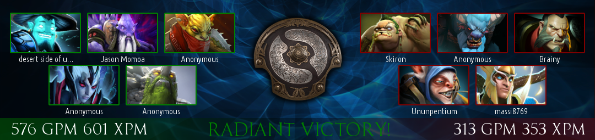

# bannner-dota-recentmatch
creates a Dota 2 match overview in form of a PNG banner

### preview: 


### variables to set :

index.php is just a demo file. banner_recentmatch.php just contains a single function, which doesn't accept any arguments as of this release. this may or may not be changed in the future.

```php
function banner_recentmatch() {
	header("Content-type: image/png");

	// account to be scanned and API key.
	$scan_acc = "your_steam3id";
	$apikey = "your_api_key";
	...
```

Note: cache/recentmatch/ is used as a buffer for the 5 most recent matches.
